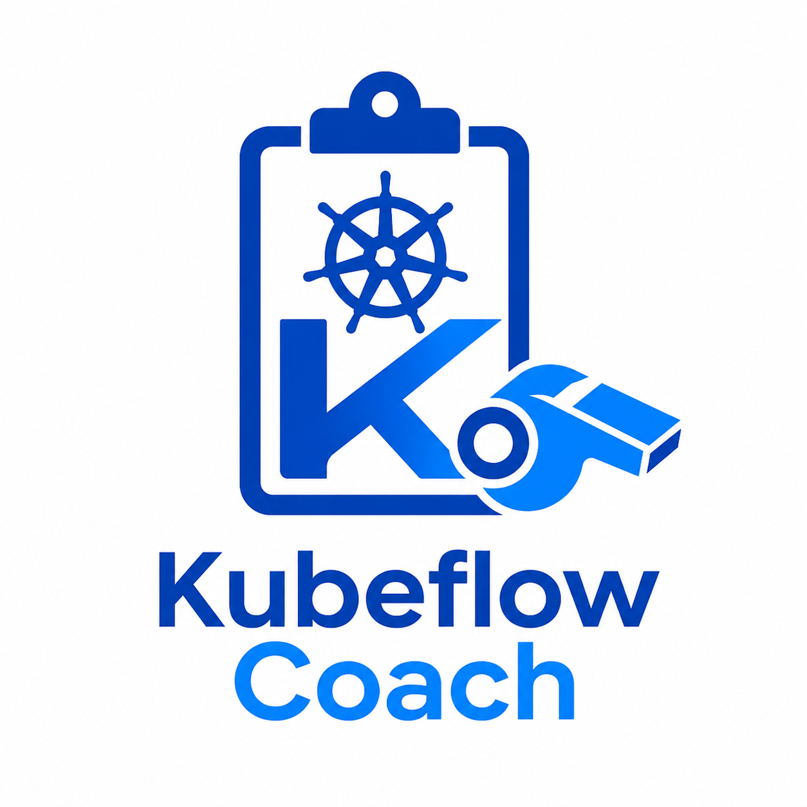

<p align="center">
  
</p>

# Kubeflow Coach

Educational simplified clone of [Kubeflow Trainer v2](https://github.com/kubeflow/trainer) for learning Kubernetes operator development.

"Coach" is a play on "Trainer". This project replicates core Kubeflow Trainer v2 concepts in a minimal way using plain `batch/v1 Jobs` instead of JobSet.

## Prerequisites

- Go 1.26+
- [kubebuilder](https://book.kubebuilder.io/quick-start.html) CLI
- [go-task](https://taskfile.dev/) (`brew install go-task`)
- kubectl
- A Kubernetes cluster (kind or minikube)

## Quick Start

```bash
# Install CRDs into your cluster
task install

# Run the controller locally (talks to cluster via kubeconfig)
task run

# In another terminal, create sample resources
kubectl apply -f config/samples/
```

## Development Commands

All commands use [Taskfile](https://taskfile.dev/). Run `task --list` to see all available tasks.

### Code Generation

Run these after modifying Go types in `api/v1alpha1/`:

```bash
task generate     # Regenerate DeepCopy methods (zz_generated.deepcopy.go)
task manifests    # Regenerate CRD YAML and RBAC rules from marker comments
```

### Build & Test

```bash
task build        # Compile operator binary → bin/manager
task test         # Run unit + integration tests (envtest)
task lint         # Run golangci-lint
task lint-fix     # Run golangci-lint with auto-fix
task fmt          # Run go fmt
task vet          # Run go vet
```

### Local Development

```bash
task install      # Apply CRDs to the current cluster
task uninstall    # Remove CRDs from the current cluster
task run          # Run controller locally (outside cluster)
```

### Cluster Deployment

```bash
task docker-build IMG=kubeflow-coach:dev    # Build container image
task docker-push IMG=kubeflow-coach:dev     # Push container image
task deploy IMG=kubeflow-coach:dev          # Deploy operator to cluster
task undeploy                               # Remove operator from cluster
```

## Architecture

See [CLAUDE.md](CLAUDE.md) for detailed project structure, architecture decisions, and concept mapping to upstream Kubeflow Trainer.

## License

Copyright 2026. Licensed under the Apache License, Version 2.0.